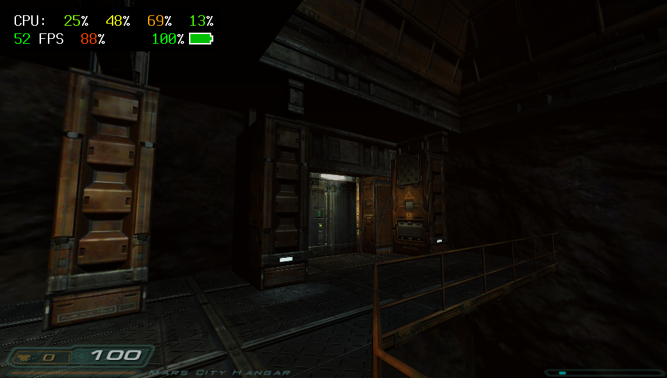

# LDhewm3 ReARMed
</img> 
LDhewm3 ReARMed is a lowend fork of [dhewwm3](https://dhewm3.org/) focusing primarily on tradeoff to ensure a decent enough graphical fidelity whilst being able to run on lowend devices.
Current focus is on a PSVita dedicated build.

## vitaGL flags

`HAVE_WRAPPED_ALLOCATORS=1 NO_DEBUG=1 DRAW_SPEEDHACK=1 CIRCULAR_VERTEX_POOL=2`

## Credits

- emileb for [d3es-multithread](https://github.com/emileb/d3es-multithread) that was used as original base for this project.
